# Pro Ticket — infraestrutura (Docker / Railway)

Repositório público com **Docker Compose** para desenvolvimento local e **Dockerfile** mínimo que referencia a imagem do bot publicada no [GitHub Container Registry](https://github.com/users/jorgehenrrique/packages/container/package/pro-ticket-bot). O uso da **imagem** do Pro Ticket está sujeito ao [EULA](EULA.md).

A **versão do bot** alinhada com a imagem `ghcr.io/jorgehenrrique/pro-ticket-bot` está no ficheiro [**VERSION**](VERSION).

## Deploy com um clique (Railway)

**Template oficial:**

[](https://railway.com/deploy/discord-ticket)

Após o deploy, siga o fluxo de OAuth no Discord (redirect para o painel web) e use `/start` no servidor, como descrito na página do template.

---

## Desenvolvimento local (`docker compose`)

1. Copie as variáveis de ambiente:

   ```bash
   cp .env.example .env
   ```

2. Edite `.env`: defina pelo menos `BOT_TOKEN`, `GUILD_ID`, `DISCORD_CLIENT_SECRET` e ajuste `BASE_URL` para `http://localhost:8080` (e `SERVER_HOSTNAME` para `localhost` se usar funcionalidades que dependam de hostname).

3. Suba MongoDB + bot (requer Docker Compose com suporte a `env_file` opcional; em versões antigas, o ficheiro `.env` tem de existir mesmo vazio):

   ```bash
   docker compose up -d
   ```

4. Abra `http://localhost:8080` para o painel web.

O `docker-compose.yml` inclui **MongoDB 8** oficial só para uso local. Os valores `root` / `changeme` devem coincidir com `MONGO_URI` no `.env` (já pré-preenchido no `.env.example`).

---

## Railway: MongoDB gerenciado + bot a partir deste repositório

A Railway **não executa** o ficheiro `docker-compose.yml` como um único stack a partir do Git; cada serviço do projeto é configurado no dashboard (ou importado a partir de um compose como _referência_). Para produção recomenda-se:

1. **MongoDB** — adicionar o plugin **Database → MongoDB** ao projeto.
2. **Bot** — novo serviço → **GitHub** → selecionar **este** repositório; a Railway deteta o `Dockerfile` na raiz e constrói a imagem a partir de `FROM ghcr.io/jorgehenrrique/pro-ticket-bot:latest`.

### Variáveis no serviço do bot

| Variável                | Obrigatória | Descrição                                                                                                                                                                 |
| ----------------------- | ----------- | ------------------------------------------------------------------------------------------------------------------------------------------------------------------------- |
| `BOT_TOKEN`             | Sim         | Token do bot (Discord Developer Portal).                                                                                                                                  |
| `GUILD_ID`              | Sim         | ID do servidor Discord.                                                                                                                                                   |
| `DISCORD_CLIENT_SECRET` | Sim\*       | Client Secret OAuth2 (necessário para login no painel web).                                                                                                               |
| `MONGO_URI`             | Sim         | URI de ligação ao MongoDB. Use **referência** ao serviço MongoDB (`${{Mongo.MONGO_URL}}` ou o nome que o template expuser — o dashboard mostra o nome exato da variável). |
| `BASE_URL`              | Sim         | URL pública HTTPS do serviço (ex.: `https://<domínio>.up.railway.app`).                                                                                                   |
| `PORT`                  | Recomendado | `8080` (deve coincidir com a porta exposta na **Networking**).                                                                                                            |
| `NODE_ENV`              | Recomendado | `production`.                                                                                                                                                             |
| `SERVER_HOSTNAME`       | Opcional    | Útil em alguns cenários (ex.: domínio público sem `https://`).                                                                                                            |
| `STEAM_API_KEY`         | Opcional    | Steam — avatares na verificação.                                                                                                                                          |

\*Obrigatória para o fluxo OAuth do painel (`DISCORD_CLIENT_SECRET` validado no servidor ao iniciar login).

### OAuth2 — redirect do painel

No Discord Developer Portal → OAuth2 → Redirects, adicione:

`https://<SEU_DOMINIO_RAILWAY>/api/auth/discord/callback`

### Rede pública

Em **Settings → Networking**, gere domínio e defina o tráfego HTTP para a porta **8080** (como no template atual).

## Recursos do Pro Ticket

Bot Discord profissional de tickets com **painel web** embutido, multi-idioma (**pt-BR**, **en-US**, **es-ES**) e mais.

### No Discord — abertura e atendimento

Painel customizável (título, cor, imagem, tipos e servidores) com botão **Abrir Ticket**:

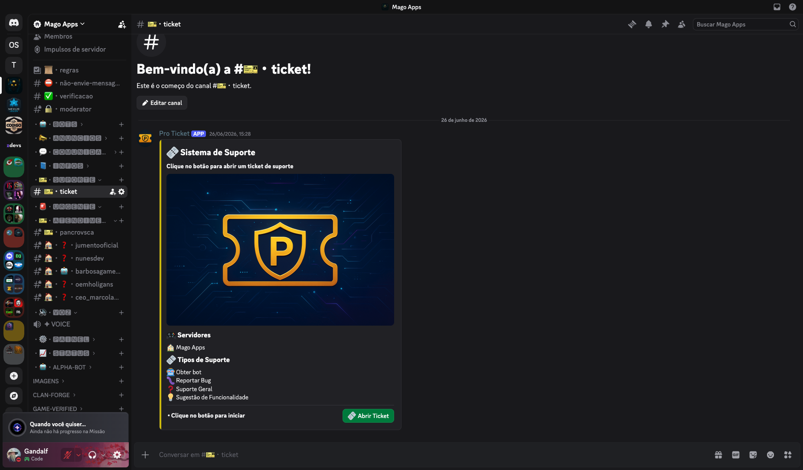

Dentro do canal do ticket: finalizar, assumir, sala de voz, manter aberto, tags e convites (`/ticketc`):

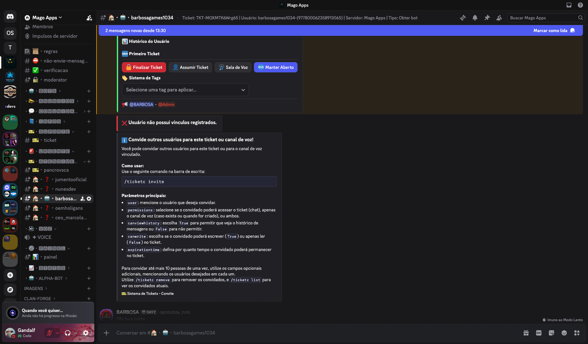

Também há automação de inatividade (aviso, auto-close, reabertura com limite e botão **Manter Aberto**), avaliações mútuas, transcripts HTML, blacklist e reputação/comportamento.

### Tipos de ticket e cargos de staff

Cada **tipo de ticket** (ex.: suporte geral, bug, obter bot) define:

- **Cargos de suporte** obrigatórios — só quem tem esses cargos vê e atende aquele tipo
- Categoria Discord opcional, limite por usuário, servidores de jogo associados
- Steam obrigatório, campos personalizados e anúncio contextual ao abrir

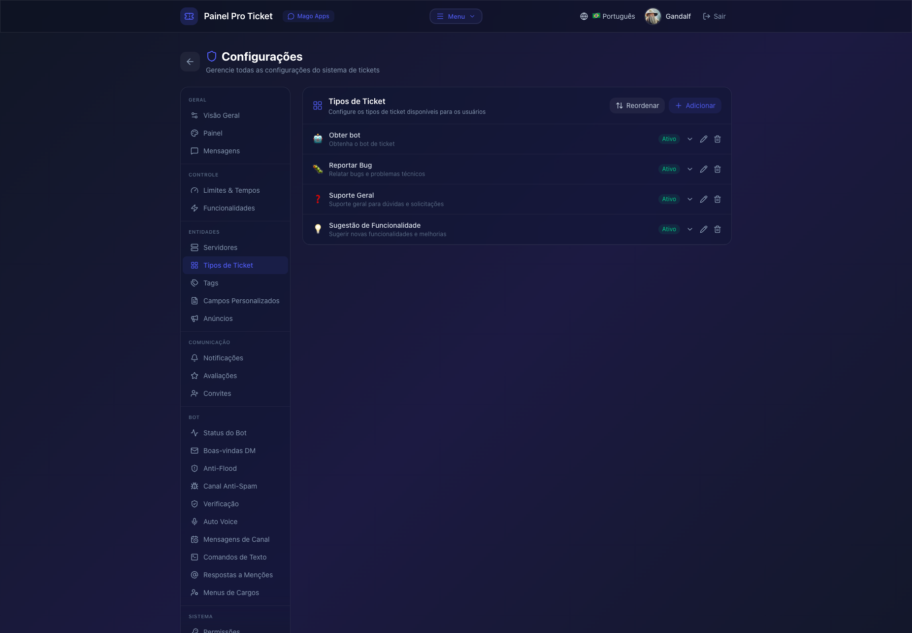

Assim você separa equipes: um tipo “Financeiro” só para o cargo financeiro, outro “Técnico” só para a equipe técnica, etc.

### Tags — equipes dinâmicas no canal

Tags categorizam o ticket e podem **trocar quem tem acesso** ao canal (texto e voz):

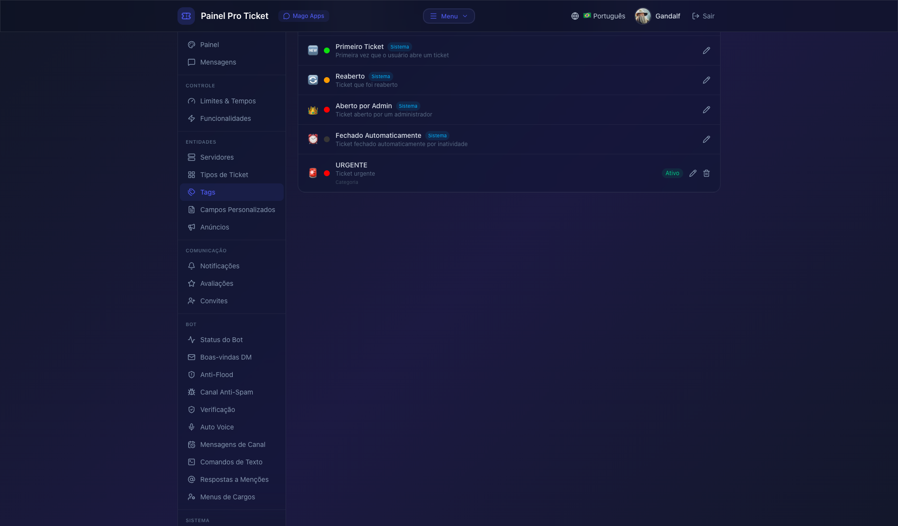

- **Cargos do canal** na tag: ao aplicar a tag, os cargos configurados **substituem** os do tipo de ticket (e de tags anteriores com cargos). Níveis **Suporte** (ver/enviar/atender) e **Gerente** (suporte + gerenciar canal/mensagens).
- Trocar de tag (ex.: de “Geral” para “URGENTE” ou “Escalado”) **remove o acesso** da equipe anterior e **concede** à nova.
- Remover a tag **recalcula** as permissões (volta aos cargos do tipo / tags restantes).
- **Cargo temporário** opcional no usuário ao aplicar a tag
- Menções de cargos em spoiler para chamar equipes sem spam
- Tags de sistema (`Primeiro Ticket`, `Reaberto`, `Aberto por Admin`, `Fechado Automaticamente`) + tags custom

### Painel web — operação e analytics

Dashboard do proprietário com estatísticas e lista de tickets abertos em tempo quase real:

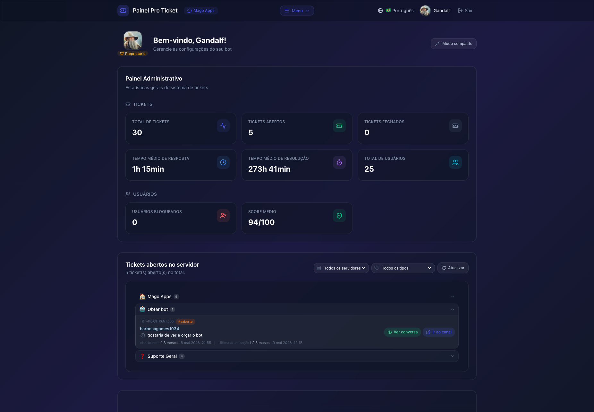

Relatórios avançados com gráficos, períodos e exportação JSON/CSV:

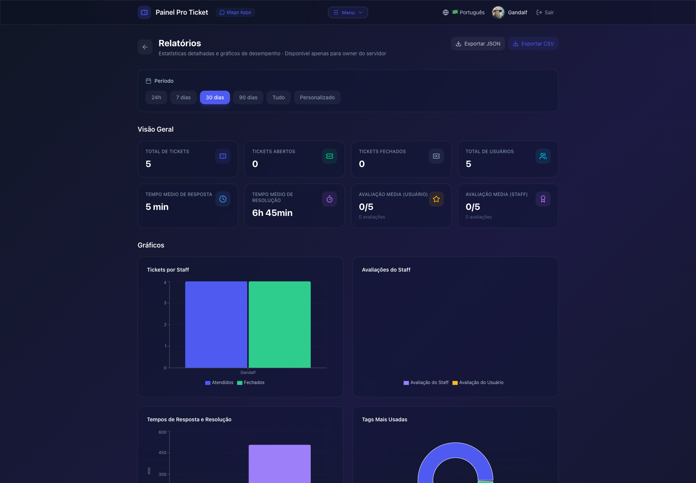

Transcript ao vivo do ticket pelo navegador:

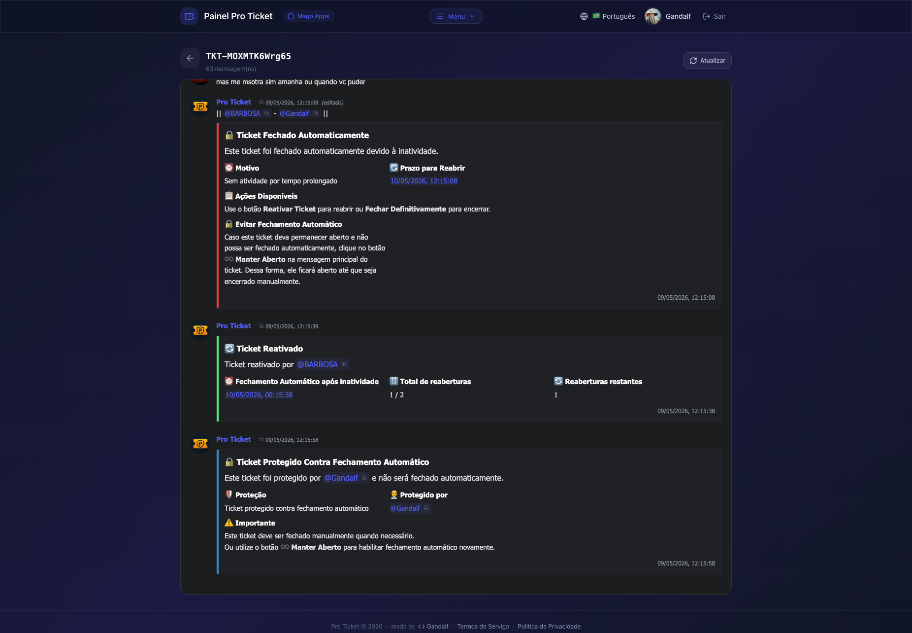

Visão geral, preview do painel, toggles de funcionalidades e organização da estrutura Discord:

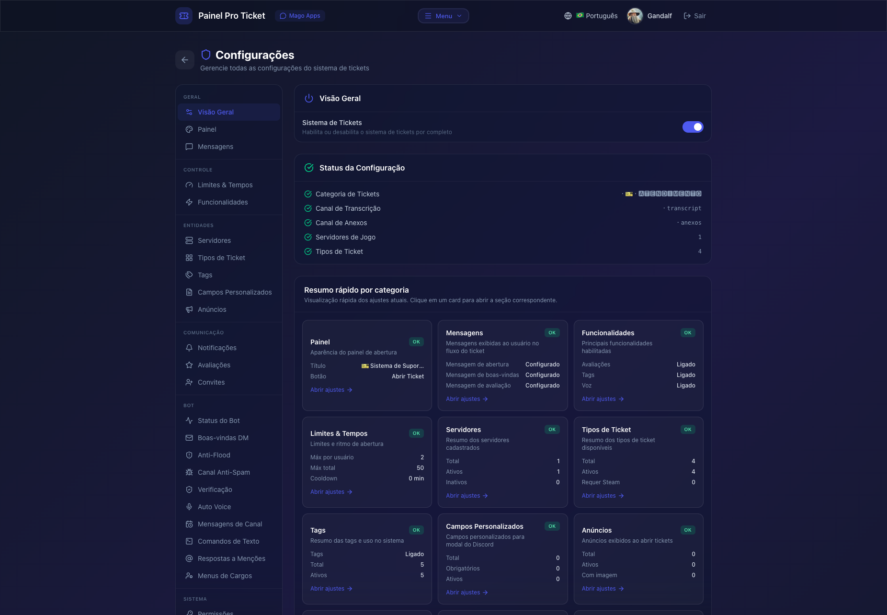

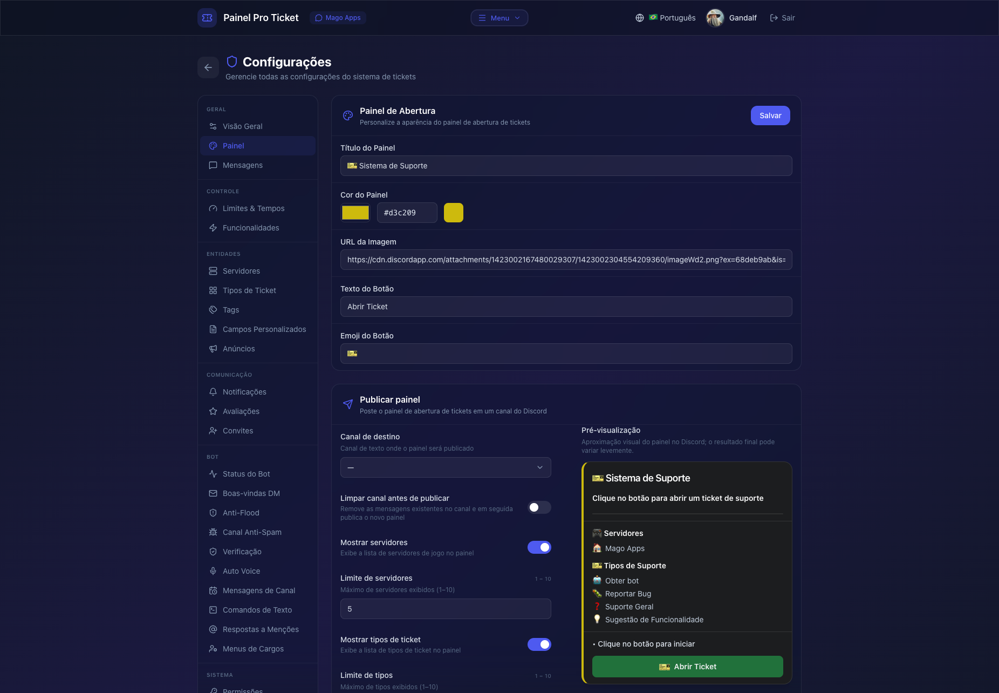

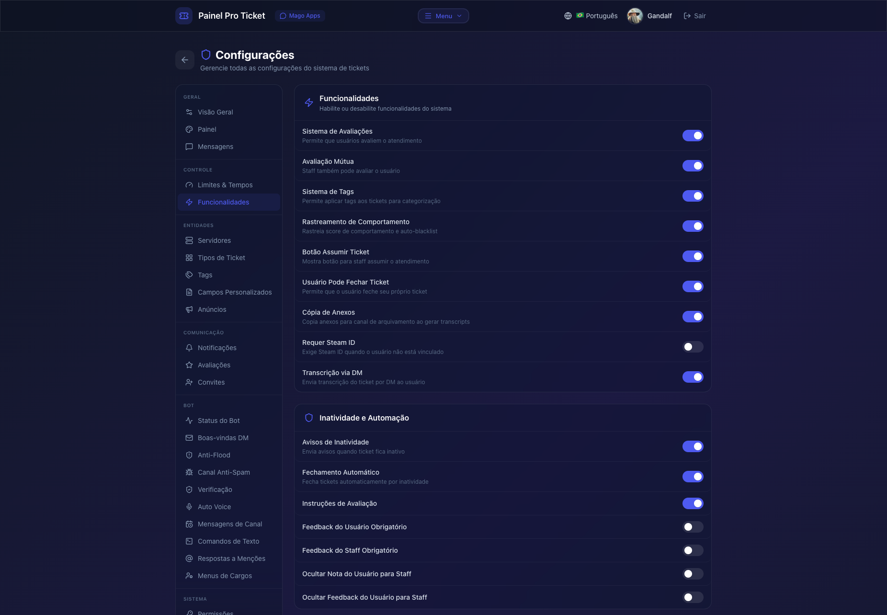

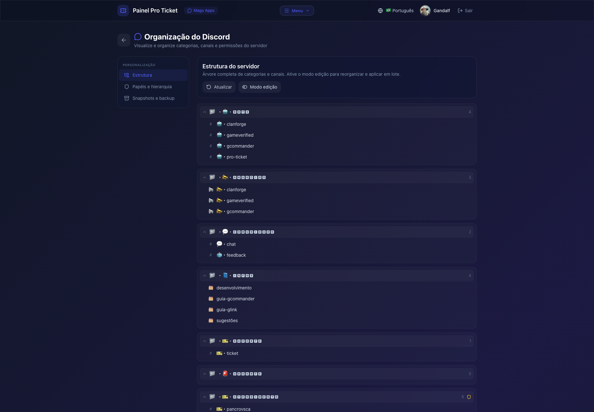

### Verificação Steam e APIs

OAuth Steam com cargo de verificado, auto-verificação ao entrar (se já houver vínculo) e canal dedicado:

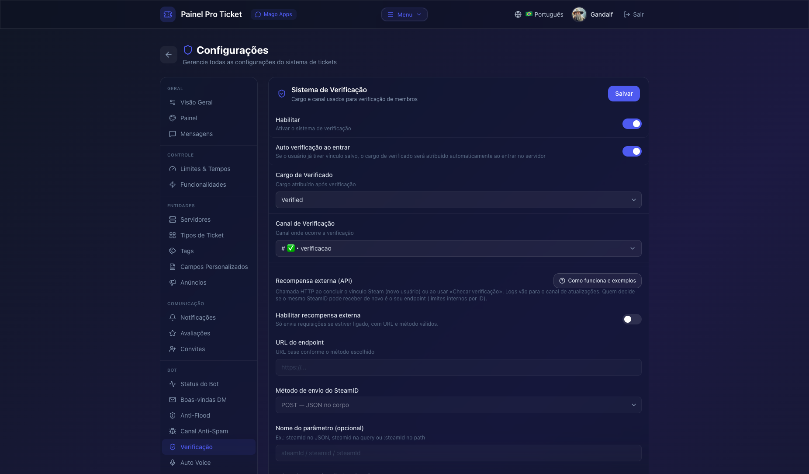

- **Recompensa externa (API):** ao concluir o vínculo (ou em “Checar verificação”), o bot chama o seu endpoint HTTP (POST JSON, query ou path com SteamID; token e headers custom opcionais)
- **API pública do bot:** token Bearer único com toggles independentes para:
  - `GET …/lookup` — consultar se Discord/Steam já está vinculado
  - `POST …/link` — **criar** vínculo Discord ↔ Steam (e aplicar cargo / recompensa)
  - `DELETE …/link` — remover vínculo e tentar retirar o cargo
- Integração com tickets (Steam no histórico, campo obrigatório se não vinculado)

### Anti-flood e canal-isca (anti-spam)

**Anti-flood:** limite de mensagens, decay, timeout automático, isenções (admin, cargos, canais, tickets):

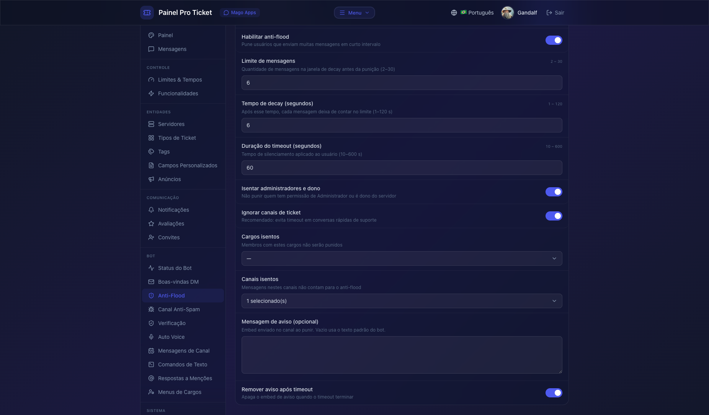

**Canal-isca:** canal no topo da lista; quem posta é punido (kick, timeout ou ban). Aviso customizável no Discord:

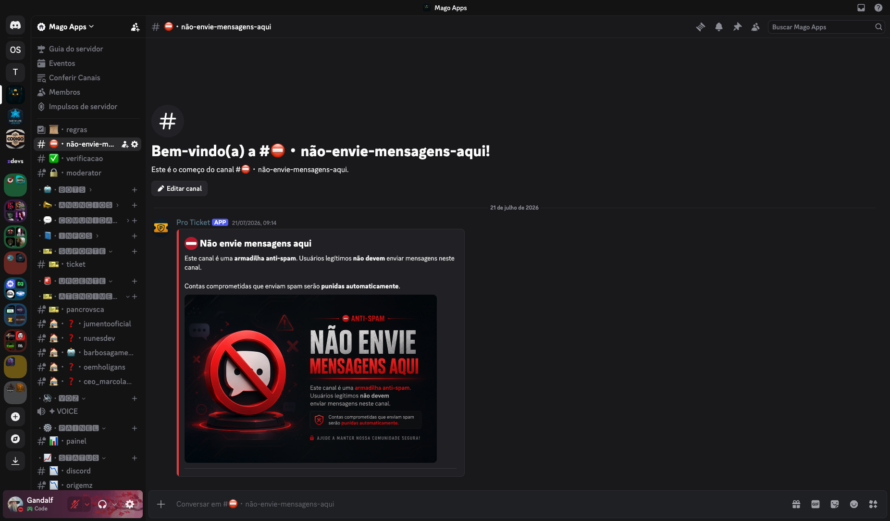

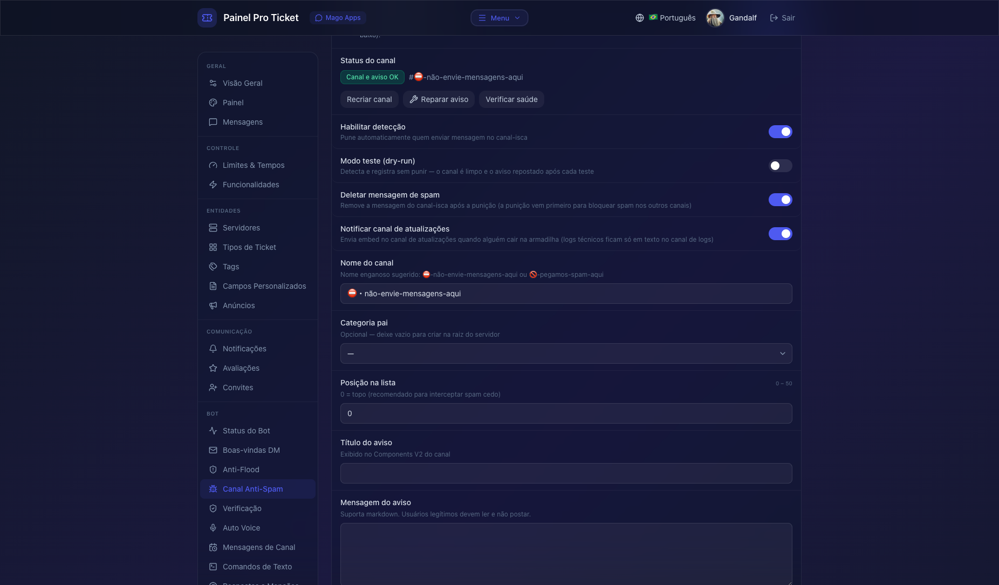

Dica: coloque o canal-isca em “Canais isentos” do anti-flood para evitar punição dupla.

### Quatro módulos de comunidade

#### 1. Mensagens de canal

Mensagens programadas / sticky (até 50), com kill-switch global.

**Modos:**

| Modo                    | Comportamento                                                                            |
| ----------------------- | ---------------------------------------------------------------------------------------- |
| **Sticky**              | Mantém o aviso sempre no fim do canal (cooldown + mín. de mensagens antes de republicar) |
| **Postar e substituir** | Reposta apagando a anterior                                                              |
| **Apenas postar**       | Envia sem apagar (pode acumular)                                                         |

Gatilhos: intervalo, diário, semanal, uma vez ou manual. Conteúdo rich (Components V2) ou texto simples.

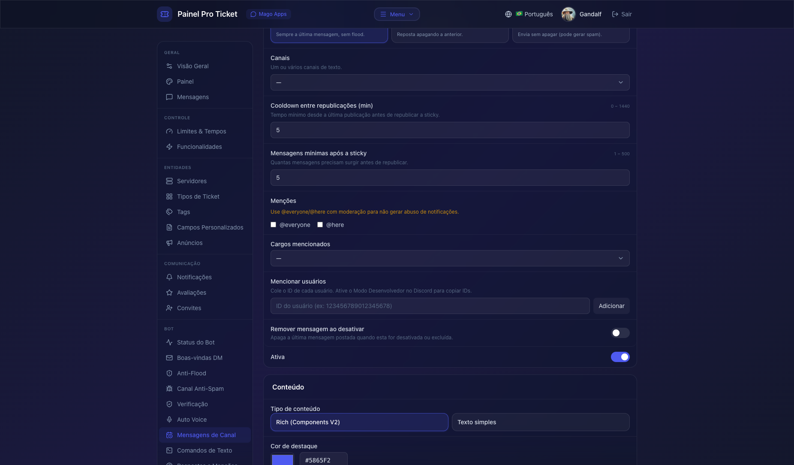

#### 2. Comandos de texto

Respostas no chat por trigger (prefixo global ou texto literal).

- Correspondência **exata** ou **começa com**; cooldown; apagar a mensagem do comando
- Escopo: todos os canais, só selecionados, excluir selecionados, só tickets / exceto tickets
- Resposta: postar no canal ou **reply**; cargos permitidos ou liberar para todos

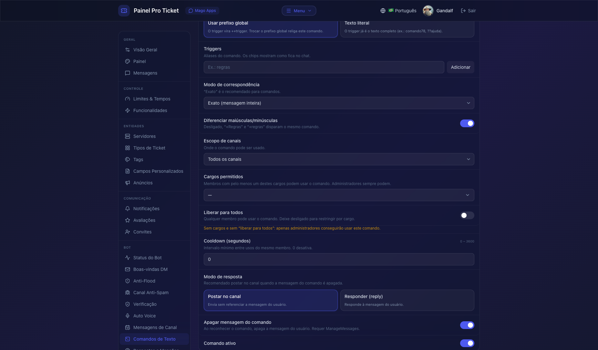

#### 3. Respostas a menções

Quando alguém menciona cargos/usuários-gatilho: responder no canal ou por DM, apagar a menção, ou ambos.

- Isenções (cargos, admins), ignorar ping de reply / auto-menção, cooldown da resposta
- Escopos de canal iguais aos dos comandos de texto

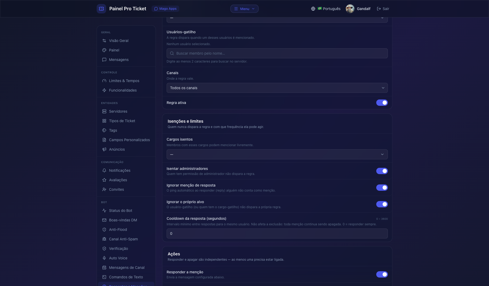

#### 4. Menus de cargos

Self-assign: membros pegam/devolvem cargos sozinhos.

**Como interagem:** botões · lista suspensa · reações

**Ao interagir:** alternar · só adicionar · só remover

Também: exclusivo (um cargo por vez), limite por membro, cooldown e confirmação efêmera.

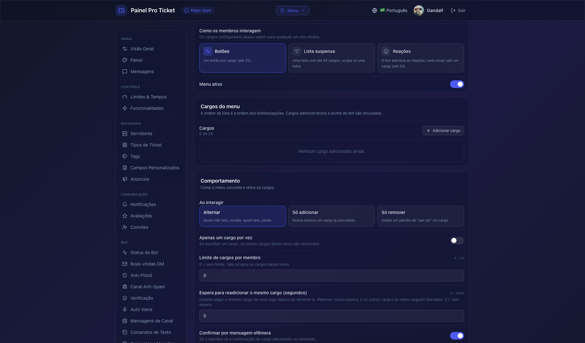

### Resumo por área

| Área                                      | Destaques                                                                                                                                           |
| ----------------------------------------- | --------------------------------------------------------------------------------------------------------------------------------------------------- |
| **Tickets**                               | Multi-servidor/tipo, cargos staff por tipo, tags com troca de permissões, campos, anúncios, convites, voz, assumir/finalizar, reabertura, blacklist |
| **Avaliações / transcripts / relatórios** | Avaliação mútua; HTML + ao vivo no painel; agendados ou sob demanda com export                                                                      |
| **Steam / API**                           | OAuth, cargo, webhook externo, API pública lookup/link/delete                                                                                       |
| **Moderação**                             | Anti-flood + canal-isca (kick/timeout/ban)                                                                                                          |
| **Comunidade**                            | Mensagens sticky/agendadas, comandos de texto, menções, menus de cargos, boas-vindas DM, auto voice                                                 |
| **Admin**                                 | Painel web completo, `/ticketadm`, `/configt`, snapshots/backup Discord                                                                             |

Comandos e rotas detalhados: canal de documentação criado pelo bot após `/start`, ou a [página do template Railway](https://railway.com/deploy/discord-ticket).

## Licença

- **Este repositório** (Dockerfile, `docker-compose.yml`, exemplos de ambiente, workflows, documentação): [MIT License](LICENSE).
- **Imagem de contentor** `ghcr.io/jorgehenrrique/pro-ticket-bot`: não está coberta pela MIT deste repositório; aplica-se o [EULA — Pro Ticket (imagem)](EULA.md) (software proprietário, código-fonte não publicado).
